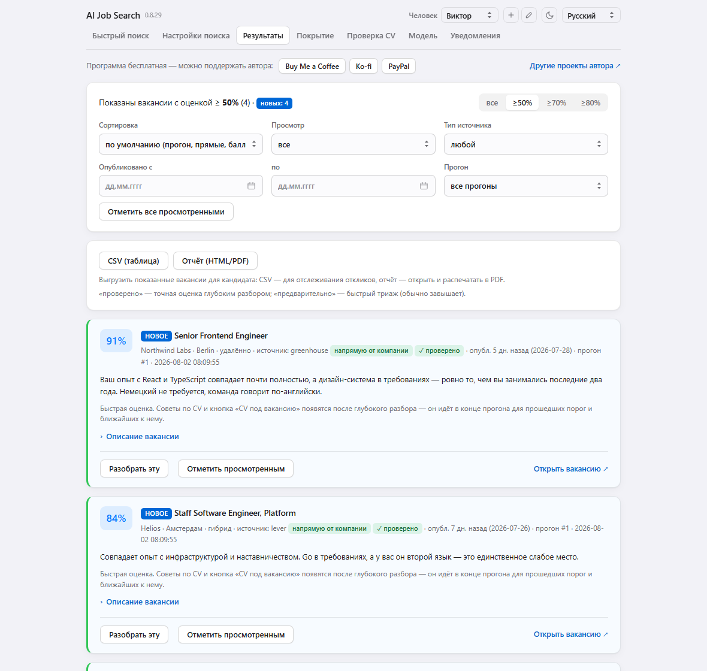
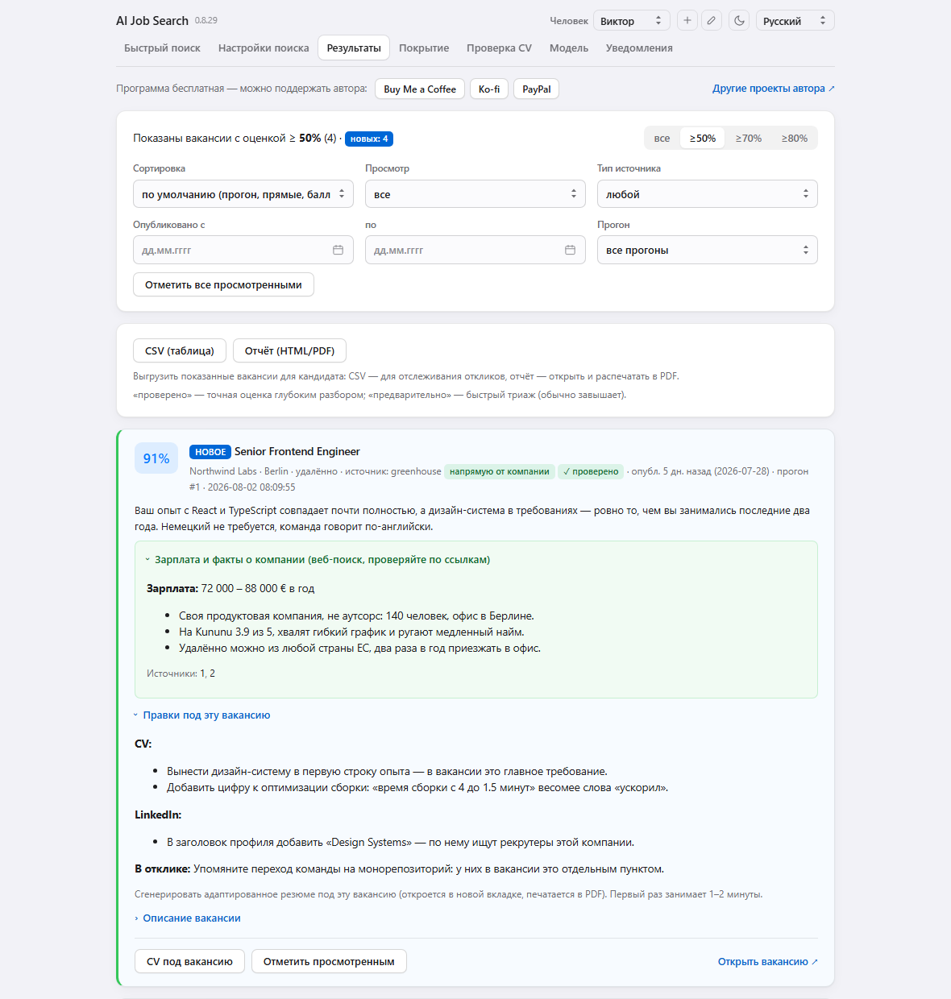
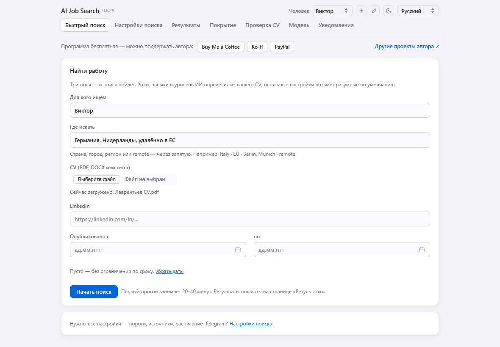
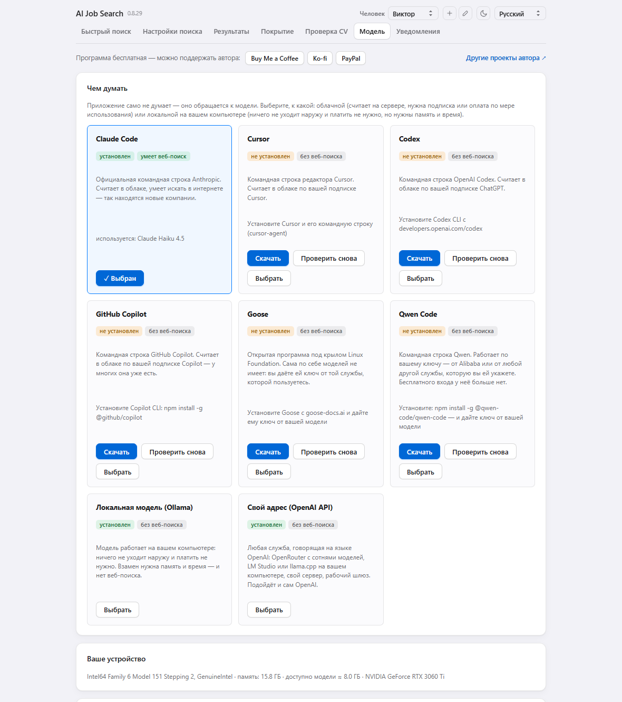

# AI Job Search

A job search that runs itself. The program reads your CV, crawls company sites,
ATS platforms and job aggregators, scores every find with a model, and explains
why a vacancy fits and what in the CV is worth adjusting for that particular
position. Results can be viewed in the window or delivered to Telegram and email.

Everything runs on your own computer: the vacancies, the CV and the scores go
nowhere except the model itself.

<!-- The screenshots come in pairs: GitHub shows whichever suits the reader's theme.
     The data in them is invented — no real people, companies or vacancies. -->
<picture>
  <source media="(prefers-color-scheme: dark)" srcset="docs/img/results-dark.png">
  
</picture>

Every find gets a score and an explanation rather than just landing in a list.
For the ones that clear the threshold: what to fix in the CV and the LinkedIn
profile, how to open the application, and a "CV for this vacancy" button.

<picture>
  <source media="(prefers-color-scheme: dark)" srcset="docs/img/advice-dark.png">
  
</picture>

Three fields are enough to start. The other settings exist, but they live
elsewhere and wait until they are needed.

<picture>
  <source media="(prefers-color-scheme: dark)" srcset="docs/img/quick-search-dark.png">
  
</picture>

The thinking is done not by the program but by a model of your choice: Claude
Code, Cursor, Codex, GitHub Copilot, Goose or Qwen, a local one through Ollama,
or any service that speaks the OpenAI protocol — OpenRouter, LM Studio, your own
server. The program shows which of them are already installed, which can search
the web, and whether your machine has enough memory for a local model.

<picture>
  <source media="(prefers-color-scheme: dark)" srcset="docs/img/models-dark.png">
  
</picture>

The screenshots were taken on an invented profile: the people, companies and
vacancies in them do not exist.

## Installation

The app opens like an ordinary program — a window, no terminal.

- **macOS** — open `AI Job Search.dmg`, drag the app onto the Applications
  shortcut and launch it from Launchpad. The build is signed with a Developer ID
  and notarised by Apple, so it opens straight away with no warnings.
- **Windows** — run `AI Job Search Setup.exe`. It installs into the user profile
  only (`%LOCALAPPDATA%\Programs\AI Job Search`), needs no administrator
  password, and appears in the Start menu. The build is not signed yet, so
  SmartScreen will say "Windows protected your PC": "More info" → "Run anyway".
  If you would rather not use an installer, there is
  `AI Job Search-windows-portable.zip`: unpack it and run `AI Job Search.exe`
  from the folder. Windows marks everything unpacked from a downloaded archive
  as "came from the internet", and .NET — which draws the app's window — refuses
  to load libraries with that mark. The app clears the mark itself on startup,
  and if the window still will not open it opens in your browser instead.
- **Linux** — unpack `AI Job Search-linux.tar.gz` and run `AI Job Search`.

On first launch the program asks what to think with: Claude Code, Cursor CLI or a
local model through Ollama. The "Download" button opens the relevant program's
page, and "Check again" finds it without a restart.

## How to use it

1. **Quick search** — name, region, CV. Roles, skills and seniority are taken
   from the CV.
2. While a run is in progress, the page shows what is happening right now and
   which step it is. The window can be closed — with background mode the search
   carries on by itself.
3. **Results** — vacancies with a match score, an explanation and CV edits for
   each one. Filters, sorting, CSV export and a printable report.
4. **Search settings** — the same thing, but with every knob: match threshold,
   sources, the company list, the schedule, Telegram and email.
5. **CV check** — whether the CV will get through an ATS robot and what a human
   will see.
6. **Coverage** — what exactly was looked at, and whether the program can see a
   particular company.

## Scheduling

Three modes: manual, on an interval, and continuous (the next run starts after a
pause following the previous one — coverage grows on its own). The schedule works
while the program is running; "Keep searching after the window is closed" and
"Start at login" are checkboxes in the settings, with no hand-written launchd
jobs.

## Several people

One instance handles several profiles: the "Person" switcher in the header. Each
has their own CV, settings, company list, results, schedule and bot.

## Language

Fourteen interface languages. The results language is chosen separately — it is
the language the model writes the scores, the CV/LinkedIn edits and the digest
in. The interface can be in one language while the CV edits arrive in another.

## Where the data lives

- macOS — `~/Library/Application Support/AI Job Search`
- Windows — `%APPDATA%\AI Job Search`
- Linux — `~/.local/share/ai-job-search`

Inside, separately per person: `config.json` (settings, including tokens),
`cv.*` and `cv.txt` (the CV and the extracted text), and `jobs.db` (the vacancies
found and the run history). The CV text only ever goes to the model you chose.

## Running from source

```bash
pip install -r requirements.txt
./run.sh
```

This opens http://127.0.0.1:8765. It needs Python 3.10+ and an installed
[Claude Code CLI](https://claude.com/claude-code) (or Cursor CLI, or Ollama).
When run from source, the data lives in `data/` next to the code.

Tests:

```bash
pip install -r requirements-dev.txt
pytest
```

They require neither network nor a model — they check the database, the
translations, the settings, the behaviour on other people's sites, and that every
page opens. On CI the build does not start until the tests pass: the pipeline
publishes the release by itself, and otherwise a breakage would go straight out
to people.

Building the app for your own system:

```bash
pip install pyinstaller
pyinstaller --clean --noconfirm packaging/aijobsearch.spec
```

Builds for all three systems happen on CI on a `v*` tag.

### Signing for macOS

Without a signature, Gatekeeper says "the developer cannot be verified" and the
app has to be opened with a right-click. To avoid that you need a **Developer ID
Application** certificate, which comes with the Apple Developer Program. An App
Store certificate will not do here: the program launches external command-line
tools (Claude Code, Cursor, Ollama) and the App Store sandbox does not allow
that — it can only be distributed as a disk image.

```bash
xcrun notarytool store-credentials aijobsearch \
  --apple-id <email> --team-id <TEAMID> --password <app-specific-password>
NOTARY_PROFILE=aijobsearch packaging/sign_macos.sh
```

The script finds the certificate in the keychain, signs the app, builds the disk
image, submits it for notarisation and staples the ticket. Without
`NOTARY_PROFILE` notarisation is skipped — the signature will be there, but the
system will still ask when the app is downloaded from the internet.

## Support

The program is free. If it was useful:
[Buy Me a Coffee](https://buymeacoffee.com/ipupok) ·
[Ko-fi](https://ko-fi.com/ipupok) ·
[PayPal](https://www.paypal.com/donate/?hosted_button_id=VBNDB5AHYLGCY)

## Other projects

[mrwd.github.io](https://mrwd.github.io/)

## Licence

MIT — see [LICENSE](LICENSE).

Third-party libraries end up inside the built app, each under its own licence.
Their list and full texts are collected at build time into
`THIRD-PARTY-LICENSES.txt` and shipped alongside the program.

## The company list grows on its own

Most vacancies that come from aggregators link straight to the employer's own
board on an ATS — `boards.greenhouse.io/<company>`, `jobs.lever.co/<company>` and
the like. The program remembers those addresses, and from the next run reads the
board in full: the aggregator showed one or two openings, the board has all of
them. On one real database 342 of the 392 links turned out to lead to boards, of
27 employers that were not being watched.

Nothing extra is downloaded for this. The links are already in hand, and neither
web search nor the model takes part — which is why coverage grows the same way
with a local model as with Claude Code.

The employers found this way are added to the same list in the settings as the
ones you typed in, so you can see what appeared and remove anything you did not
want. The checkbox "Remember employers found in job links" turns it off
altogether.

## How the program behaves on other people's sites

It identifies itself honestly — `ai-job-search/<version> (+a link to the repository)` —
keeps a pause between requests to the same host, and respects `robots.txt`: if a
site asks robots not to read a page, the program skips it and notes that in the
log. The `robots.txt` rule does not apply to the platforms' documented APIs
(Greenhouse, Lever, Adzuna and others) — those exist for programs — but the pause
and the honest name apply there too.
